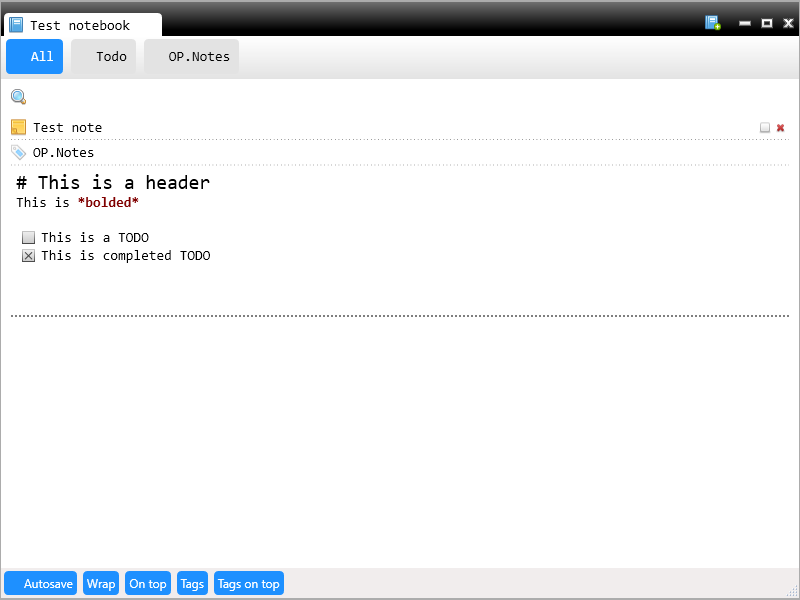

# Project Description
OP.Notes is a small note taking application which I've created after searching for a long time for a note taking application which would suit my needs:
- It should work offline
- If it has any formatting it should be in markdown syntax
- It should enable me to create simple TODO lists by having ability to place checkboxes into notes
- It should support images in notes
- It should store data as simple as possible (plain text would be best)

The closest I could come up with was Evernote but I was not really satisfied with its GUI so I've decided to create my own version.

# Requirements
.NET Framework 4.5 or later

# Features
- Its a WPF desktop application without any cloud or network requirements
- It supports multiple Notebooks which it displays a tabs at the top of the window
- Each Notebook is stored as plain text file in a folder 'Notebooks' which is inside the main application folder - makes it easy to backup and use as portable application
- Each note is plain text and can be copy/pasted as standard text (no rich text/html support!)
- Each image in note is stored in sub-folder images so it can be updated/changed by any image editor (Note: deleting note/notebook does not delete image, you have to do this manually)
- Has simple formatting of notes
  - Bold support with markdown syntax- \*\*bold\*\*
  - Heading support with markdown syntax (only one header level) - \# Header
  - Paste image from clipboard with markdown-like syntax
  - Place TODO items by typing in square brackets (\[\] for uncompleted, \[x\] for completed)
- Supports 'tagging' system to quickly navigate notes
- Supports instant-filtered search

If you would copy/paste the screenshot text into a notepad you would get the following text:

\# This is a header  
This is *bolded*  

\[\]This is a TODO  
\[x\]This is completed TODO 

# Missing features
- No global undo/redo - undo/redo works when editing a single note but not across all notes or other non-text manipulation actions (such as note/notebook deleting)
- Can not change settings - things like notebook folder and Autosave interval are hard-coded into the application. There is no possibility to change the settings
- Image manipulation - any displayed image is automatically zoomed out to fit into the display area. You can not select to show image in full resolution.
- Paste image from file - you may only paste from clipboard

 

# How to use
Once you start the application you will be presented with a basically empty window. 

- At the bottom of the screen there are several toggle buttons:
- Autosave - This will toggle autosave feature. If the feature is turned off then you need to press <CTRL> + S in order to save. If autosave is enabled then notebook(s) are saved at predefined intervals (every 10 seconds), as soon as you switch between them or when you exit the application
- Wrap - Each note has a text editor (excellent AvalonEdit control and this will turn on/off wordwrap feature for all notes in all notebooks
- On top - Makes the window stay on top of all other windows
- Tags - Turns off display of Tags for all notebooks
- Tags on top - Tags displayed on top or on the left side of the notebook 

## Creating notebook
Click on the 'New note' button in the top right corner to create a new notebook.
Enter the notebook name in the tab and hit <ENTER>. You can change the notebook name at any time by doubleclicking on the tab. 
Once the notebook is created you can start creating notes

## Deleting notebook
You can delete a notebook by clicking on a small 'x' which appears if you hover over the notebook tab. 
Note: OP.Notes always makes backup of notebook on each save so you always have the deleted notebook available, it is in the Notebooks folder with extension *.bak

## Creating notes
Once you have notebook you can press <CTRL> + N to create a new notebook.

Each note has the following parts:
- Title - This is the note title
- Tags - List of comma separated strings which represent tabs
- Note content - Note editor

## Deleting notes
Each note has a small delete 'x' button on the far top right side.
Note: OP.Notes always makes backup of notebook on each save so you can get back accidentally deleted notes by checking the backup file, it is in the Notebooks folder with extension *.bak. However if you save the notebook again (or you make modification and Autosave feature is turned on) then the note will be lost forever.

## Tags
For each note you may enter as many tag strings that you want. Tags have to be separated with commas. Once you enter a tag for a note the tag will automatically appear in the list of tags for that particular notebook. Once you have tags you may limit the displayed notes by selecting the tag at the top of the notebook.
You can select multiple tags in the following way:
- By holding the <CTRL> key - this will select/deselect a tag
- By checking the checkbox inside the tag - this will make the tag permanently selected

Each notebook has two **special** tags:
- All - this tag, when selected, always displays all notes. Use it to quickly remove any selected tags
- TODO - this tag, when selected, will display only those notes which have at least one 'uncompleted' checkbox inside

## Note editor
Note content is done via Avalon text editor with some additional features so standard text editing (no rich text/html) is done as in any other editor. Additional supported features are:
- Unchecked checkbox - You can enter unchecked checkbox by typing [] characters, or by clicking your mouse on checked checkbox
- Checked checkbox - You can enter checked checkbox by typing [x] characters, or by clicking your mouse on unchecked checkbox
- Headers - Prefixing a line with # character will make it displayed big as a header (Note: it has to be the first character in line)
- Bold - surrounding text with * character will make it displayed bold
- Image - Editor supports pasting an image in it. It only works if you have copied the actual image data to clipboard. It does not work if you try to copy/paste an actual image file from Explorer. Image is automatically saved in Notebooks/Images subfolder with the current date and time as the image name.

## Filtering
You can filter the the messages by entering the text inside a textbox located next to the magnifier icon.

## Code quality
Disclaimer: The application was created out of my immediate need and I am not a WPF programmer so please DON'T LOOK AT THE CODE! Seriously the code can be better but I did not have enough time. I will probably refactor most of it in future.
Do not use the code to learn WPF as it is not written in WPF 'spirit'.